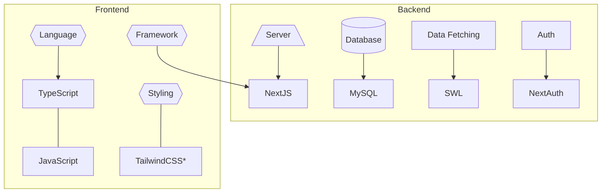
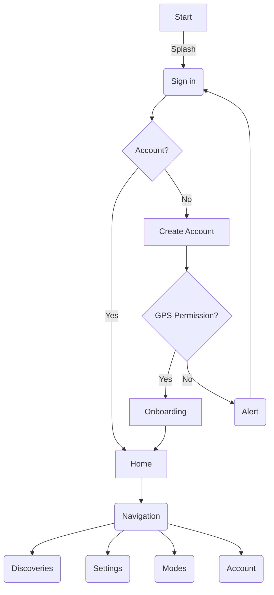

###### **Capstone Project** - Institute of Data Software Engineering Bootcamp

# **Guiding Star**
### Aotearoa Night Sky Discovery App

##### This project aims to create an educational, interactive resource for NZ naked eye stars with a focus on Maori astronomy and mythology.

#### Objectives:

1. Star and planet catalogue with Maori names and myths
2. Interactivity for users - zooming, panning, search, filter, favourites
3. Simulate the night sky based on the user's location and time
4. 3D rendered accurate star map of naked eye objects
6. Maramataka moon months and timekeeping
7. Mythology - incorporate AI to provide worldwide mythology about stars and planets, perhaps generate an image too
8. AR mode with star position in real-time/ match phone position
9. Night mode

#### Technology:

###### *may also look into HeadlessUI or MaterialUI for styling

#### Timeframe:

#### User Flow:

